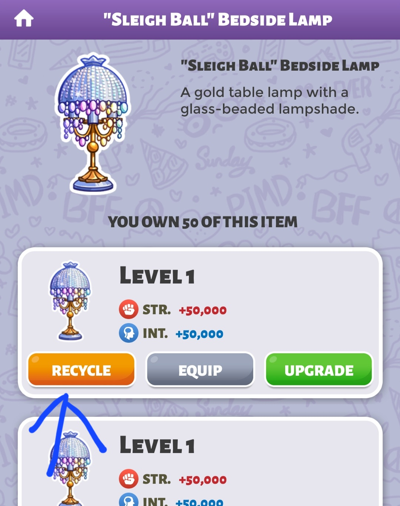
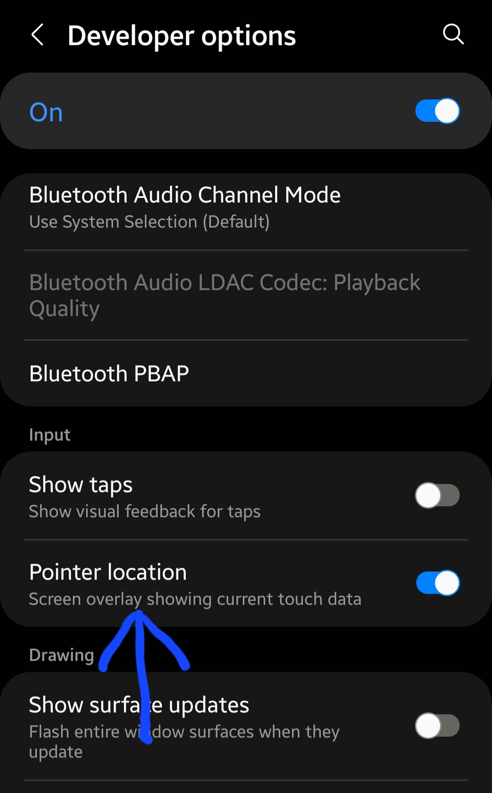

# PIMD Furniture Auto Recycler

Simple python script to automatically recycle furniture in PIMD using `adb` because I am too lazy to manually recycle 100+ furnitures.

Requirements:

1. ADB: For debian based OS: `sudo apt install adb`
2. USB debugging needs to be enabled. Run `adb devices` to check if your device is connected.
3. Python ADB: `pip install pure-python-adb`

----

## IMPORTANT: READ BEFORE RUNNING THE SCRIPT

The `RECYCLE_POS` constant contains the coordinates of the **_first_** recycle button,
**not the _hold to recycle_ button**. See image below:

  
Show/Hide Image 1

   

The position for the RECYCLE button is different for each device. So, you have to find yours:

1. Go to developer options.
2. Enable "Pointer Location". Enabling this shows the coordinate of your touch
3. See image below

   

      
Show/Hide Image 2

      
   

4. Go back to the recycle screen from image 1 shown above. Tap and hold the recycle button that
   the arrow is pointing to in image 1.
5. The coordinates you want will be shown at the top of the screen. The format will be something
   like `X: 180.9       Y: 1061.9`. Tip: Don't focus too much on getting the exact coordinates.
6. Those are the coordinates that should be used in the `RECYCLE_POS` constant.

Now, for the `HOLD_RECYCLE_POS` constant. It is the coordinates of the button that actually does the
recycling. It is the button you have to hold down.

Repeat the steps above to find the coordinates of it.

----

## NOTE:

1. You should be on the screen shown in image 1 when you run the program